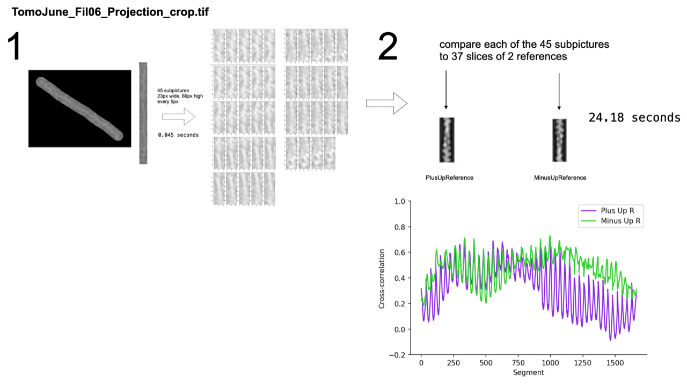

# actinPolarity

Help:

> python actinPolarity.py -h

Example:
> python actinPolarity.py -i ./data/PositiveControl/FilamentProjections/TomoJune_Fil06_Projection_crop.tif -refPlus ./data/ReferenceImageStacks/PlusUp.tif -refMinus ./data/ReferenceImageStacks/MinusUp.tif -o ./output_Fil06/

Example usage for all filaments in data:

python actinPolarity.py -i ./data/PositiveControl/FilamentProjections/TomoApril_Fil01_Projection_crop.tif -refPlus ./data/ReferenceImageStacks/PlusUp.tif -refMinus ./data/ReferenceImageStacks/MinusUp.tif -o ./output_AFil01

python actinPolarity.py -i ./data/PositiveControl/FilamentProjections/TomoApril_Fil02_Projection_crop.tif -refPlus ./data/ReferenceImageStacks/PlusUp.tif -refMinus ./data/ReferenceImageStacks/MinusUp.tif -o ./output_AFil02

python actinPolarity.py -i ./data/PositiveControl/FilamentProjections/TomoApril_Fil09_Projection_crop.tif -refPlus ./data/ReferenceImageStacks/PlusUp.tif -refMinus ./data/ReferenceImageStacks/MinusUp.tif -o ./output_AFil09

python actinPolarity.py -i ./data/PositiveControl/FilamentProjections/TomoApril_Fil14_Projection_crop.tif -refPlus ./data/ReferenceImageStacks/PlusUp.tif -refMinus ./data/ReferenceImageStacks/MinusUp.tif -o ./output_AFil14

python actinPolarity.py -i ./data/PositiveControl/FilamentProjections/TomoApril_Fil29_Projection_crop.tif -refPlus ./data/ReferenceImageStacks/PlusUp.tif -refMinus ./data/ReferenceImageStacks/MinusUp.tif -o ./output_AFil29

python actinPolarity.py -i ./data/PositiveControl/FilamentProjections/TomoJune_Fil01_Projection_crop.tif -refPlus ./data/ReferenceImageStacks/PlusUp.tif -refMinus ./data/ReferenceImageStacks/MinusUp.tif -o ./output_JFil01

python actinPolarity.py -i ./data/PositiveControl/FilamentProjections/TomoJune_Fil03_Projection_crop.tif -refPlus ./data/ReferenceImageStacks/PlusUp.tif -refMinus ./data/ReferenceImageStacks/MinusUp.tif -o ./output_JFil03

python actinPolarity.py -i ./data/PositiveControl/FilamentProjections/TomoJune_Fil06_Projection_crop.tif -refPlus ./data/ReferenceImageStacks/PlusUp.tif -refMinus ./data/ReferenceImageStacks/MinusUp.tif -o ./output_JFil06

python actinPolarity.py -i ./data/PositiveControl/FilamentProjections/TomoJune_Fil07_Projection_crop.tif -refPlus ./data/ReferenceImageStacks/PlusUp.tif -refMinus ./data/ReferenceImageStacks/MinusUp.tif -o ./output_JFil07

python actinPolarity.py -i ./data/PositiveControl/FilamentProjections/TomoJune_Fil08_Projection_crop.tif -refPlus ./data/ReferenceImageStacks/PlusUp.tif -refMinus ./data/ReferenceImageStacks/MinusUp.tif -o ./output_JFil08
